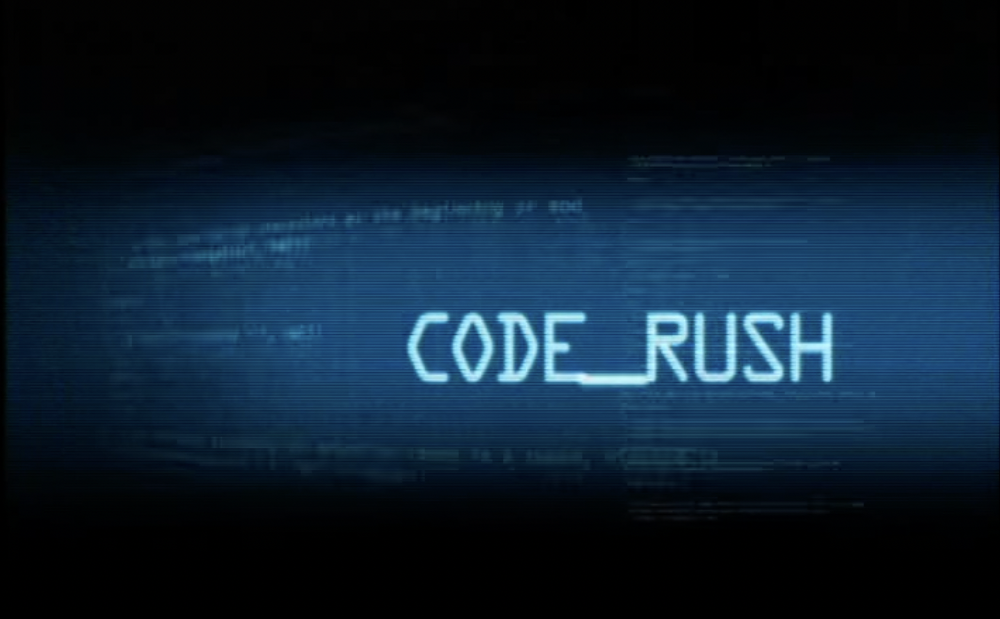

# Final course project -- 2023

  

For the final course project (fcp), you will handle a real-world dataset. In
particular, you are required to store, manipulate, and analyze
[bug](https://en.wikipedia.org/wiki/Bug_(engineering)) data for the
[Mozilla](https://www.mozilla.org/en-GB/) project.  Mozilla is a peculiar
example of [open source
software](https://en.wikipedia.org/wiki/Open-source_software) (OSS) development
originating from [Netscape](https://en.wikipedia.org/wiki/Netscape), a computer
services company.

OSS challenges common managerial assumptions on the organizing and functioning
of organizations (Gulati et al., 2012), attracting the interest of research
enthusiasts from several disciplines (e.g., information systems, management, and
sociology). But the OSS phenomenon is also extremely relevant from a business
perspective. For example, you may think of the Python project or the father of
all – Linux (powering NASA projects, Chrome OS, Android hardware, and the
largest share of worldwide servers). The OSS experience keeps offering fresh
business and research insights and may guide us in the next phase of
organizing technologies based on remote work.

  

Mozilla has employed the
[Bugzilla](https://www.bugzilla.org/about/) software as a bug-tracking system
since its early stages. For this project, you will handle bugs for the 1997-2003
development window.

## Tasks

You are required to choose your preferred DBMS -- PostgreSQL or MongoDB -- and:

1. Clean, manipulate, and structure data. The expected result is a well-designed
   dataset that complies with the specific approach of the chosen DBMS.
2. Provide valuable descriptive insights. The expected result is a set of
   descriptive statistics that depicts some interesting trends or noteworthy
   data characteristics.
3. _[optional]_ Perform insightful data analysis. For example, you can
   try to uncover how organizational problems are allocated
   to participants. You may want to check the recent work of [Tonellato et al. (2023)](https://pubsonline.informs.org/doi/full/10.1287/orsc.2023.1674) 
   to get a sense of how to perform such a task. If this topic does not
   fit your interests, you may want to skim through the reference list
   provided to get some inspiration.

To perform tasks 1 and 2, you need to use either `SQL` or `MQL` (MongoDB query language).
Alternatively, if you prefer using Python, you can leverage `psycopg2` or `pymongo`.
For what concerns task 3, you should use `PySpark` (e.g., you may want to leverage the
[MLlib](https://spark.apache.org/docs/latest/api/python/reference/pyspark.ml.html) pyspark library).

## Data

The `fcp` is based on **bug** data for the Mozilla project hosted at Bugzilla. A
bug is a defect in the design, manufacture or operation of software generating
undesired results or impeding operation ([Wikipedia definition](https://en.wikipedia.org/wiki/Bug_(engineering))).

The data can be retrieved at this
[link](https://cityuni-my.sharepoint.com/:f:/g/personal/matteo_devigili_2_city_ac_uk/EgeVseU65ShDkWIJLgvncZMB9bFLGNBYXIx5wKmVob6Q2w?e=ocMiff).
In particular, you can find:

| folder               | content     | time frame              | size   | #bugs   |
| -------------------- | ----------- | ----------------------- | ------ | ------- |
| archive-mozilla-bugs | bug history | 1997-03-19 - 2003-08-05 | 2.9 GB | 215,173 |

Data are stored in `pickle` format. Please, check [load_data.py](https://github.com/mattDevigili/dms-smm695/blob/master/final-course-project/load_data.py) for an example of loading pickle files.

To get a sense of the data structure, I suggest you explore the available data
either in MongoDB or Python. Also, check the Bugzilla@Mozilla
[documentation](https://bmo.readthedocs.io/en/latest/) to get further info.

If you are interested in expanding the data collected, you can consider the
following library:

- [python-bugzilla](https://github.com/python-bugzilla/python-bugzilla)

## Deliverables

By July 21st (4:00 PM, London time), groups have to upload:

- SQL, JS, or Python scripts;
- Supporting documentation (accepted format: .md, .docx, or .pdf) containing:
  - a detailed justification of your design choices;
  - a clear and concise description of the insights coming from descriptive
      statistics obtained;
  - _[optional]_ a clear and concise description of further insights and results obtained
      analyzing data through PySpark.

Please keep the supporting document within 3,000 words excluding tables and
figures.

## References

Here you can find some academic articles dealing with open-source software:

- [Amrit, C., & Van Hillegersberg, J. (2010). Exploring the impact of soclo-technlcal core-periphery structures in open source software development. Journal of Information Technology, 25(2), 216-229.](https://journals.sagepub.com/doi/pdf/10.1057/jit.2010.7)
- [Baldwin, C. Y., & Clark, K. B. (2006). The architecture of participation: Does code architecture mitigate free riding in the open source development model?. Management Science, 52(7), 1116-1127.](https://pubsonline.informs.org/doi/pdf/10.1287/mnsc.1060.0546)
- [Dahlander, L., & Wallin, M. W. (2006). A man on the inside: Unlocking communities as complementary assets. Research Policy, 35(8), 1243-1259.](https://www.sciencedirect.com/user/identity/landing?code=hreFr5zfHodonoFE0XSn1DUKWwk0UY4Gnyovz3NA&state=retryCounter%3D0%26csrfToken%3D6a2d8891-7717-417b-a042-43e057b847bc%26idpPolicy%3Durn%253Acom%253Aelsevier%253Aidp%253Apolicy%253Aproduct%253Ainst_assoc%26returnUrl%3D%252Fscience%252Farticle%252Fpii%252FS0048733306001387%26prompt%3Dnone%26cid%3Darp-04ef023c-0573-49cd-aab3-ec3bd486fbb5)
- [Gulati, R., Puranam, P., & Tushman, M. (2012). Meta‐organization design: Rethinking design in interorganizational and community contexts. Strategic Management Journal, 33(6), 571-586.](https://onlinelibrary.wiley.com/doi/pdf/10.1002/smj.1975?casa_token=GZEbOaeQ5okAAAAA:1Gi86pTax0ouNlXkyC4nVruDsbu4u2wKRUBgWgqVGmAF3-zRtbfLNkwPdPXrRGW_5kWNJpS_eruQhAA)
- [He, V. F., Puranam, P., Shrestha, Y. R., & von Krogh, G. (2020). Resolving governance disputes in communities: A study of software license decisions. Strategic Management Journal, 41(10), 1837-1868.](https://onlinelibrary.wiley.com/doi/pdf/10.1002/smj.3181)
- [O'Mahony, S., & Ferraro, F. (2007). The emergence of governance in an open source community. Academy of Management Journal, 50(5), 1079-1106.](https://www.jstor.org/stable/pdf/20159914.pdf)
- [O'Mahony, S., & Bechky, B. A. (2008). Boundary organizations: Enabling collaboration among unexpected allies. Administrative Science Quarterly, 53(3), 422-459.](https://journals.sagepub.com/doi/pdf/10.2189/asqu.53.3.422)
- [Von Krogh, G., Haefliger, S., Spaeth, S., & Wallin, M. W. (2012). Carrots and rainbows: Motivation and social practice in open source software development. MIS Quarterly, 649-676.](https://www.jstor.org/stable/pdf/41703471.pdf)

Here you can find some further readings:

- [The cathedral and the bazaar](https://firstmonday.org/ojs/index.php/fm/article/download/1472/1387?inline=1)
- [The WIRED Guide to Open Source Software](https://www.wired.com/story/wired-guide-open-source-software/)
- [History of the Mozilla Project](https://www.mozilla.org/en-GB/about/history/)

A cool documentary on the transition at Netscape from proprietary to open-source software:

An amazing documentary on the early stages of open source:

