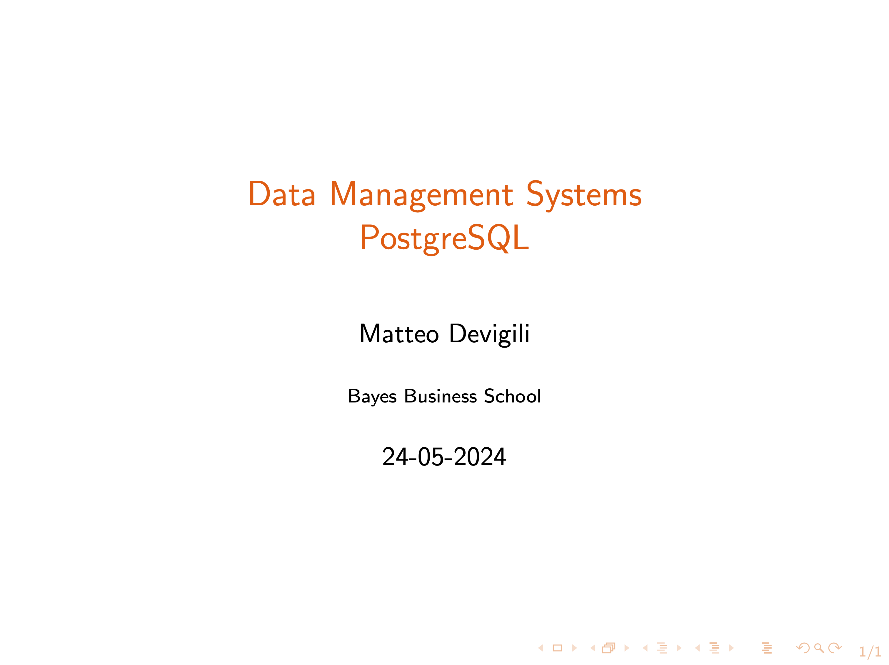

# Week 1

Lecture recording:

In this video, you will: (i) learn some basics of relational databases, (ii)
have a first introduction to PostgreSQL through psql and pgAmin4, and (iii)
learn how to create and drop databases, schemas, and tables.

The video is structured into eleven components:

| Week (dd-mm) | Topics                             | Min   |
| ------------ | ---------------------------------- | ----- |
| 1 (26-05)    | Introduction to RDMS               | 0:00  |
|              | Installation                       | 6:25  |
|              | psql                               | 14:34 |
|              | PgAdmin 4                          | 18:00 |
|              | Create a database                  | 23:15 |
|              | Create a schema                    | 27:28 |
|              | Create a table without constraints | 29:50 |
|              | Insert data                        | 34:58 |
|              | Data types:                        | 41:41 |
|              | --- Numeric                        |       |
|              | --- Monetary                       |       |
|              | --- Character                      |       |
|              | --- Date and time                  |       |
|              | Drop (Database, Schema, Table)     | 56:45 |
|              | Import/Run a .sql file             | 59:51 |

Other material available:

1. [hw_1.md](https://github.com/mattDevigili/dms-smm695/blob/master/week-1/hw_1.md): homework
1. [ls_1.pdf](https://github.com/mattDevigili/dms-smm695/blob/master/week-1/ls_1.pdf): lecture slides
1. [sc_1.sql](https://github.com/mattDevigili/dms-smm695/blob/master/week-1/sc_1.sql): lecture sql script
1. [webinar-1](https://github.com/mattDevigili/dms-smm695/blob/master/week-1/webinar-1): webinar 1 materials
