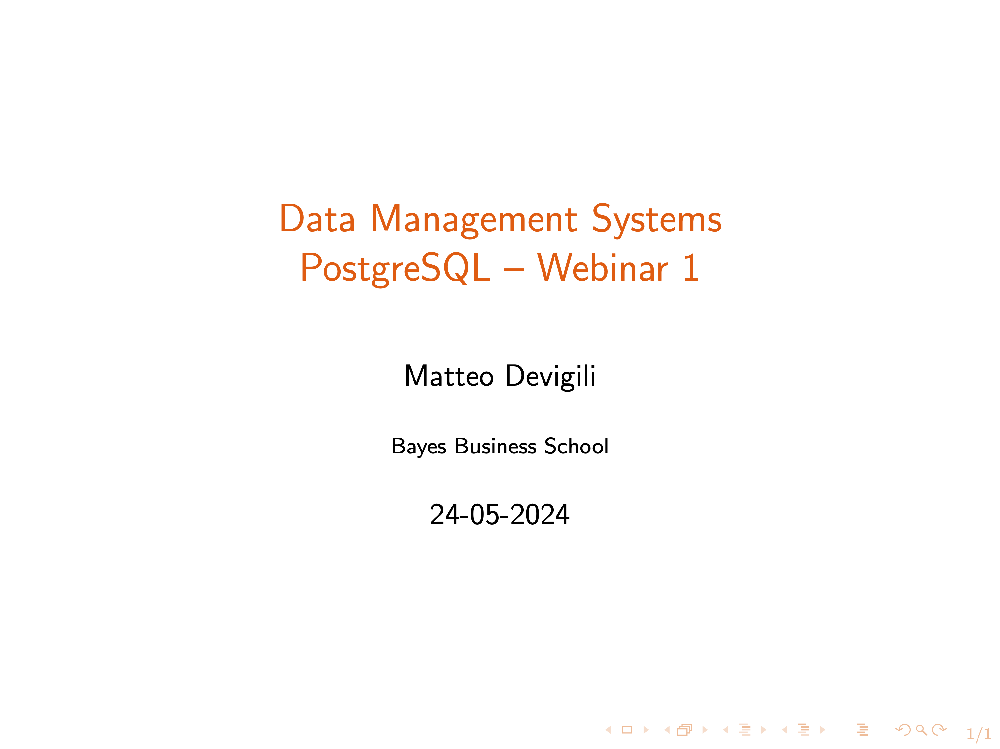

# Webinar 1 -- Structure

Webinar recording:



Here you can find the structure for the first webinar. In particular, we will
discuss: (i) module organization and functioning; (ii) basics of the relational
model; (iii) SQL create, delete, and insert.

| **Week (date)** | **Agenda**                                       |
|-----------------|--------------------------------------------------|
| 1 (26-05)       | Introduction to SMM695                           |
|                 | [PostgreSQL vs MongoDB](https://www.mongodb.com/compare/mongodb-postgresql) |
|                 | Relational model                                 |
|                 | _Q&A_                                            |
|                 | Group discussion -- artworks sample              |
|                 | ER diagrams                                      |
|                 | Homework solutions                               |
|                 | _psql_ via _PgAdmin_ or _Terminal_               |
|                 | Loading the _Pagila_ example                     |

During the _group discussion_, you will be provided with a small random sample of
the _artworks_data.csv_ retrieved at the [Tate](https://github.com/tategallery/collection#usage) GitHub repo.

**Please review the pre-recorded material and inspect the artwork sample before attending this webinar.**

## Material

Webinar materials:

* [whs_1.sql](https://github.com/mattDevigili/dms-smm695/blob/master/week-1/webinar-1/whs_1.sql): solutions for the [hw_1.md](https://mattdevigili.github.io/dms-smm695/week-1/hw_1.html);
* [artwors.csv](https://github.com/mattDevigili/dms-smm695/blob/master/week-1/webinar-1/artworks.csv): a small and simplified version of the [artworks_data.csv](https://github.com/tategallery/collection/blob/master/artwork_data.csv);
* [erd.png](https://github.com/mattDevigili/dms-smm695/blob/master/week-1/webinar-1/erd.png): an entity relation diagram obtained with [PgAdmin 4](https://www.pgadmin.org/docs/pgadmin4/6.9/erd_tool.html);
* [wsc_1.sql](https://github.com/mattDevigili/dms-smm695/blob/master/week-1/webinar-1/wsc_1.sql): a possible schema for the artworks case built with SQL.

### Pagila

To load the [Pagila](https://github.com/devrimgunduz/pagila) example, please do the following:

**1).** Open psql;

**2).** Create a new database and connect:

```sql
CREATE DATABASE pagila;
\c pagila;
```

**3).** Use \i to run the SQL script:

```sql
\i /PATH/TO/pagila-schema.sql;
\i /PATH/TO/pagila-data.sql;
```
