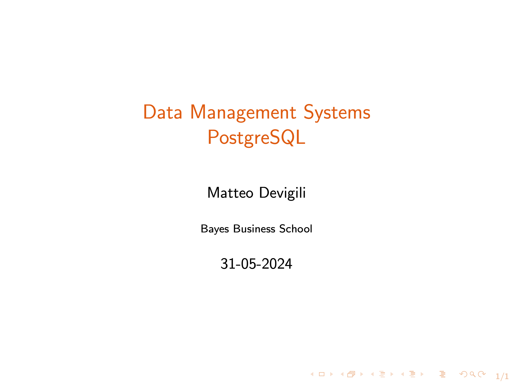

# Week 2 -- First steps with SQL

Lecture recording:

In this video, you will learn: (i) how to create a table with constraints, (ii) how to
import data, and (iii) how to interact with your data employing some basic SQL
operators and functions.

The video is structured into 6 components:

| Week (dd-mm) | Topics              | Min   |
| ------------ | ------------------- | ----- |
| 2 (31-05)    | Constraints:        | 0:00  |
|              | -- Not Null         |       |
|              | -- Unique           |       |
|              | -- Primary Key      |       |
|              | -- Check            |       |
|              | Import data         | 16:55 |
|              | Basics -- P1        | 28:38 |
|              | -- WHERE            |       |
|              | -- LIMIT, OFFSET    |       |
|              | -- OR, AND, NOT     |       |
|              | Basics -- P2        | 34:46 |
|              | -- DISTINCT         |       |
|              | -- LIKE, iLIKE      |       |
|              | -- BETWEEN          |       |
|              | -- ORDER BY         |       |
|              | Aggregate functions | 48:31 |
|              | GROUP BY            | 51:35 |

Other material available:

1. [data](https://github.com/mattDevigili/dms-smm695/blob/master/week-2/data): data to reproduce lecture 2
1. [hw_2.md](https://mattdevigili.github.io/dms-smm695/week-2/hw_2.html): homework
1. [ls_2.pdf](https://github.com/mattDevigili/dms-smm695/blob/master/week-2/ls_2.pdf): lecture slides
1. [sc_2.sql](https://github.com/mattDevigili/dms-smm695/blob/master/week-2/sc_2.sql): lecture sql script
1. [webinar-2](https://mattdevigili.github.io/dms-smm695/week-2/webinar-2/): webinar 2 materials
