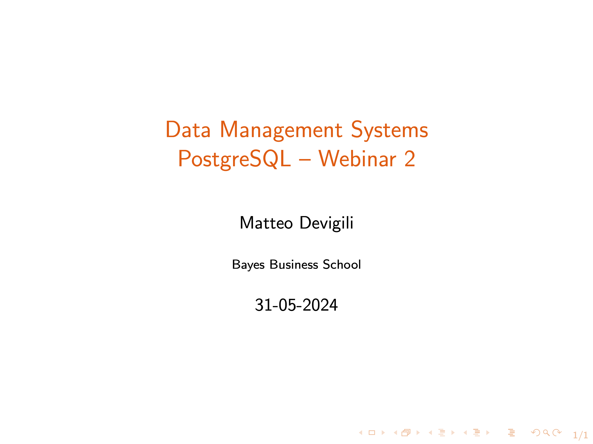

# Webinar 2 --- Structure

Webinar recording:



Here you can find the structure for the second webinar.

| **Week (date)** | **Agenda**                                       |
|-----------------|--------------------------------------------------|
| 2 (02-06)       | Recap and Q&A                                    |
|                 | Introduction to Design Theory (part one)         |
|                 | - In-class exercise                              |
|                 | [Pagila](https://github.com/devrimgunduz/pagila) |
|                 | - Loading                                        |
|                 | - SQL examples                                   |
|                 | - Introduction to functions                      |
|                 | [Psycopg2](https://www.psycopg.org/docs/)        |
|                 | - Basic usage                                    |
|                 | - Homework solutions                             |

## Material

Webinar materials:

* [wn_2.sql](https://github.com/mattDevigili/dms-smm695/blob/master/week-2/webinar-2/wn_2.ipynb): solutions for the [hw_2.md](https://mattdevigili.github.io/dms-smm695/week-2/hw_2.html) via [Psycopg2](https://www.psycopg.org/docs/);
* [ws_2.pdf](https://github.com/mattDevigili/dms-smm695/blob/master/week-2/webinar-2/ws_2.pdf): webinar slide.
* [wsc_2.sql](https://github.com/mattDevigili/dms-smm695/blob/master/week-2/webinar-2/wsc_2.sql): interacting with Pagila.

## Loading Pagila

Please, download the [pagila-master](https://github.com/devrimgunduz/pagila/archive/refs/heads/master.zip). Then:

**1).** Open psql;

**2).** Create a new database and connect:

```sql
CREATE DATABASE pagila;
\c pagila;
```

**3).** Use \i to run the SQL script:

```sql
\i /PATH/TO/pagila-schema.sql;
\i /PATH/TO/pagila-data.sql;
```

## Python set-up

### Create a Python Environment

If you are a Pure-Python user do:

```{python}
python3 -m venv my_env
```

Check [venv](https://docs.python.org/3/library/venv.html) for further reference.

If you are Conda user do:

```{python}
conda create -n my_env python=3.x
```

Check [conda create](https://docs.conda.io/projects/conda/en/latest/user-guide/tasks/manage-environments.html#creating-an-environment-with-commands) for further reference.

### Install libraries

The [requirements.txt](https://github.com/mattDevigili/dms-smm695/blob/master/environment/requirements.txt) contains Python libraries to install.

If you are a Pure-Python user do:

```{python}
pip install -r requirements.txt
```

If you are a Conda user do:

```{python}
conda install --file requirements.txt
```
