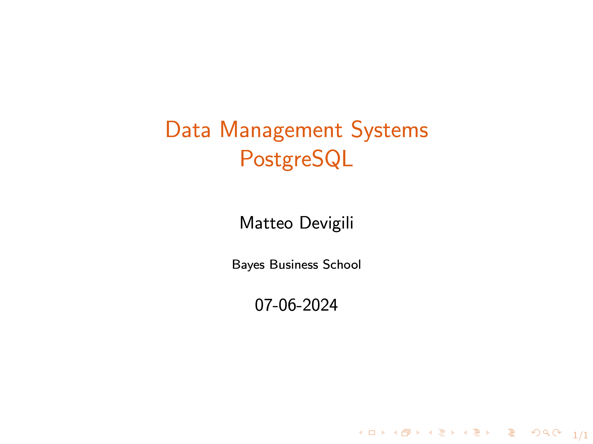

# Week 3 -- Joins

Lecture recording:

In this video, you will learn: (i) how to modify tables and update observations,
(ii) how to leverage on the foreign key constraint, (iii) how to join tables,
and (iv) how to export results.

The video is structured into 5 components:

| Week (dd-mm) | Topics                     | Min   |
| ------------ | -------------------------- | ----- |
| 3 (07-06)    | Set-up                     | 0:00  |
|              | -- ALTER                   |       |
|              | -- DELETE                  |       |
|              | -- UPDATE                  |       |
|              | Foreign Key                | 5:42  |
|              | Joins:                     | 17:37 |
|              | -- Inner                   |       |
|              | -- Left/Right/Full (Outer) |       |
|              | -- Cross                   |       |
|              | Export data                | 37:36 |
|              | Concluding remarks         | 42:44 |

Other material available:

1. [hw_3.md](https://mattdevigili.github.io/dms-smm695/week-3/hw_3.html): homework
1. [ls_3.pdf](https://github.com/mattDevigili/dms-smm695/blob/master/week-3/ls_3.pdf): lecture slides
1. [sc_3.sql](https://github.com/mattDevigili/dms-smm695/blob/master/week-3/sc_3.sql): lecture sql script
1. [webinar-3](https://mattdevigili.github.io/dms-smm695/week-3/webinar-3/): webinar 3 materials
