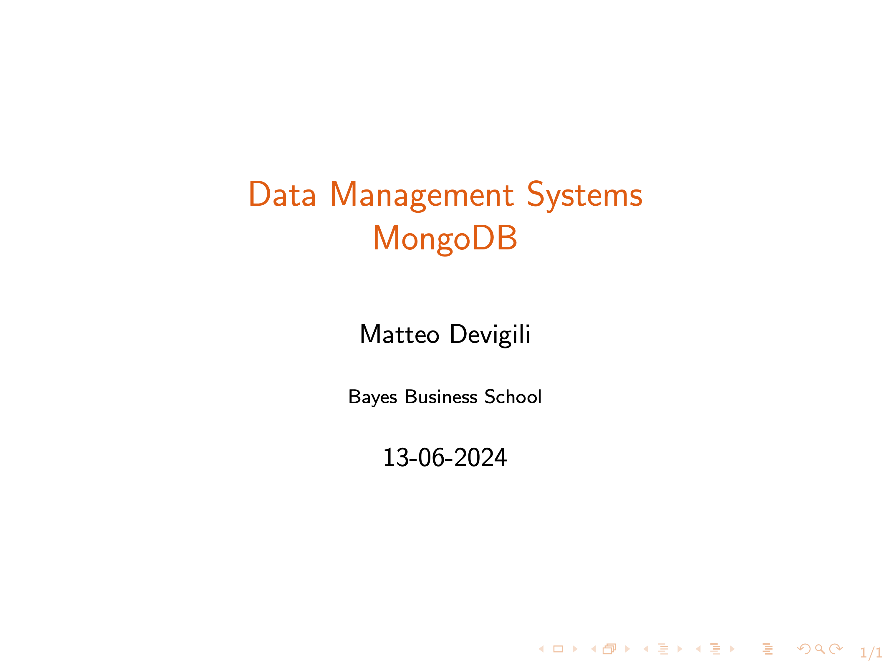

# Week 4 -- Introduction to schemaless databases with Mongo

Lecture recording:

In this video, you will: (i) learn some basics of JSON, (ii) have a first
introduction to MongoDB through the Mongo Shell and MongoDB Compass, (iii)
explore CRUD (create, read, update, and delete) operations.

The video is structured into 10 components:

| Week (dd-mm) | Topics                       | Min   |
| ------------ | ---------------------------- | ----- |
| 4 (13-06)    | Introduction to Json         | 0:00  |
|              | Introduction to MongoDB      | 04:56 |
|              | Installation MongoDB         | 14:05 |
|              | Set-up MongoDB Atlas         | 16:04 |
|              | Installation MongoDB Compass | 18:48 |
|              | CRUD operations:             | 22:03 |
|              | --- Insert                   | 24:37 |
|              | --- Read                     | 38:14 |
|              | --- Update and Replace       | 45:14 |
|              | --- Delete and Drop          | 56:20 |

Other material available:

1. [installation](https://mattdevigili.github.io/dms-smm695/week-4/installation/): MacOS and Windows
1. [hw_4.md](https://mattdevigili.github.io/dms-smm695/week-4/hw_4.html): homework
1. [ls_4.pdf](https://github.com/mattDevigili/dms-smm695/blob/master/week-4/ls_4.pdf): lecture slides
1. [sc_4.js](https://github.com/mattDevigili/dms-smm695/blob/master/week-4/sc_4.js): lecture js script
1. [webinar-4](https://mattdevigili.github.io/dms-smm695/week-4/webinar-4/): webinar 4 materials
