# Installing the Mongo Shell

Here you can find guidelines to set-up the Mongo Shell on your computer,
installing [MongoDB Community Edition](https://docs.mongodb.com/manual/administration/install-community/):

1. [MacOS](#macos), further guidance at [Mongo Docs](https://docs.mongodb.com/manual/tutorial/install-mongodb-on-os-x/)
1. [Windows](#windows), further guidance at [Mongo Docs](https://docs.mongodb.com/manual/tutorial/install-mongodb-on-windows/)

For Linux users, please follow [MongoDB online guidelines](https://docs.mongodb.com/manual/administration/install-on-linux/) 
for your OS (e.g., [Red Hat](https://docs.mongodb.com/manual/tutorial/install-mongodb-on-red-hat/), [Ubuntu](https://docs.mongodb.com/manual/tutorial/install-mongodb-on-ubuntu/),
[Debian](https://docs.mongodb.com/manual/tutorial/install-mongodb-on-debian/)).

## MacOS

Installing MongoDB via Homebrew.

### Homebrew Install 

On MacOS, type the following on your terminal (skip step 1 and 2 if you already have Xcode and Homebrew):

1. Install [Xcode](https://developer.apple.com/xcode/):

```bash
xcode-select --install
```

2. Install [Homebrew](https://brew.sh):

```bash
/bin/bash -c "$(curl -fsSL https://raw.githubusercontent.com/Homebrew/install/HEAD/install.sh)"
```

3. Run:

```bash
brew tap mongodb/brew
```

4. Now you can install the MongoDB Community Edition:

```bash
brew install mongodb-community@5.0
```

### Run MongoDB

5. To run MongoDB as a MacOS service, type on your terminal:

```bash
brew services start mongodb-community@5.0
```

6. Then, you can start the mongo shell typing:

```bash
mongo
```

7. To exit from the mongo shell, you can simply type:

```js
exit
```

8. To stop running MongoDB:

```bash
brew services stop mongodb-community@5.0
```

## Windows

1. Visit the MongoDB Download centre. Select Community Edition, Windows x64, and 
download the **MSI** file:

<div align="center">   
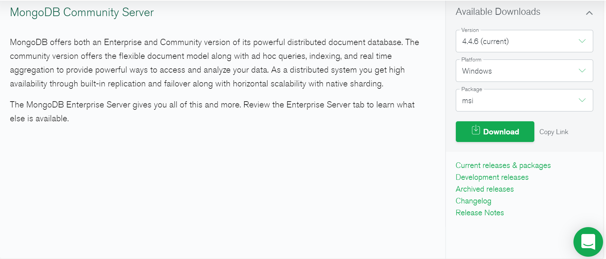
</div>

2. Once the download is completed, click on the downloaded file. The expected
   result is the following:

<div align="center">   
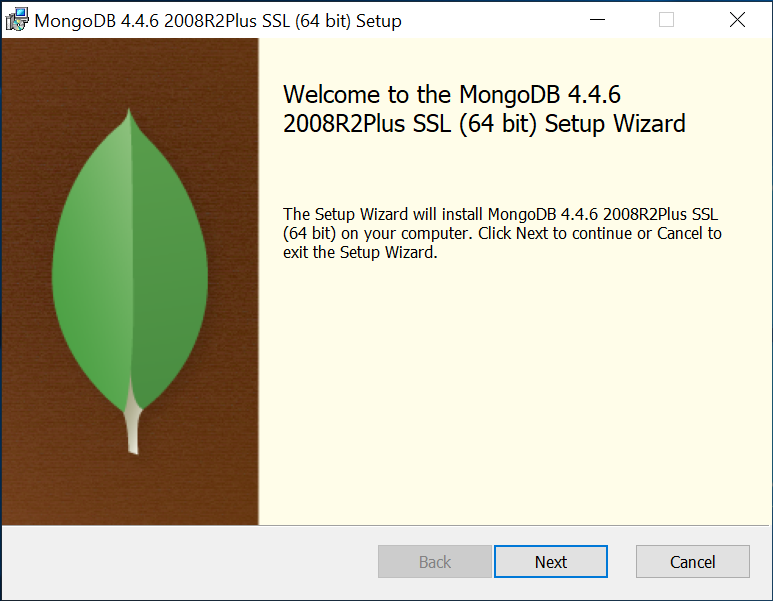
</div>

3. Click **Next**

4. Then, accept _'terms in the Licence Agreement'_:

<div align="center">
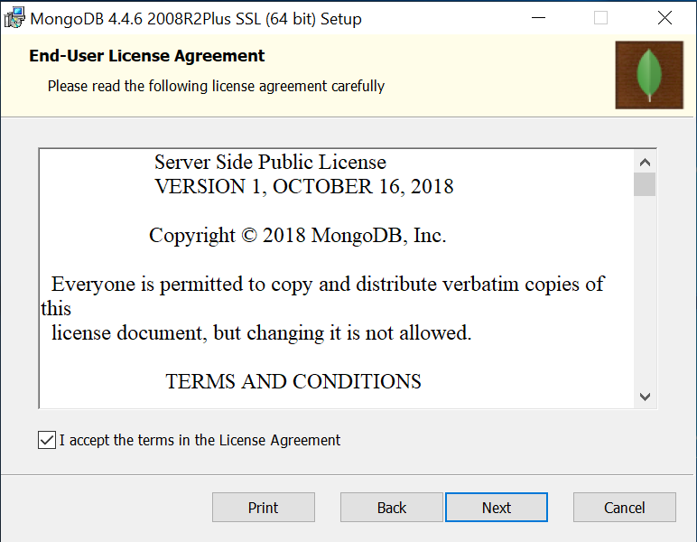
</div>


5. Choose the **complete** set-up type:

<div align="center">
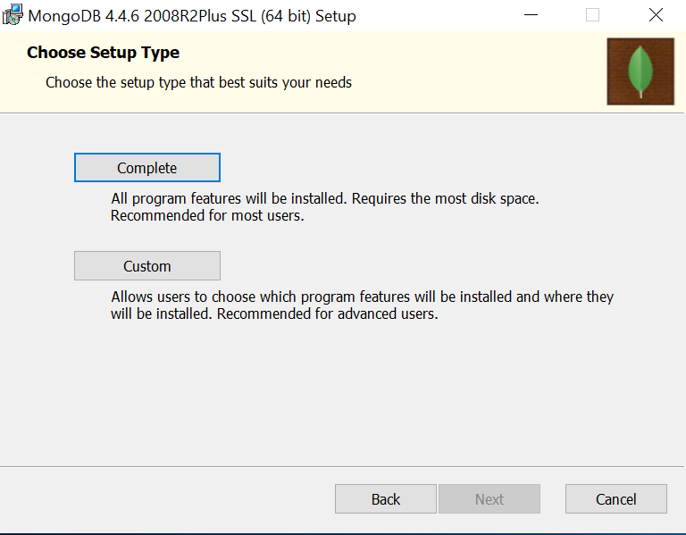
</div>


6. Leave **default** settings and click next:

<div align="center">
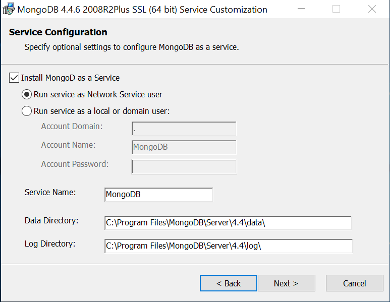
</div>


7. Do not install MongoDB Compass here. So, **uncheck** the box `Install MongoDB
   Compass`:

<div align="center">   
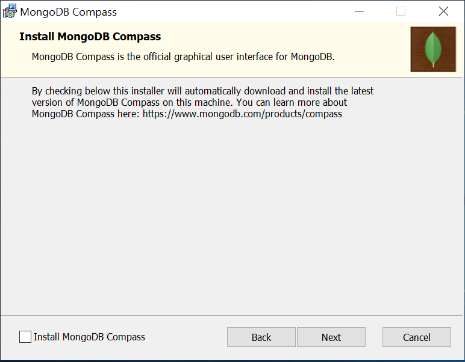
</div>


8. Click **Next**

9. Then, click **Install**

10. When the installation is completed, click **Finish**

11. Navigate to the following directory:

```bash
 C:\Program Files\MongoDB\Server\4.4\bin
 ```

12. Check that everything is fine. The expected outcome should be:

<div align="center">
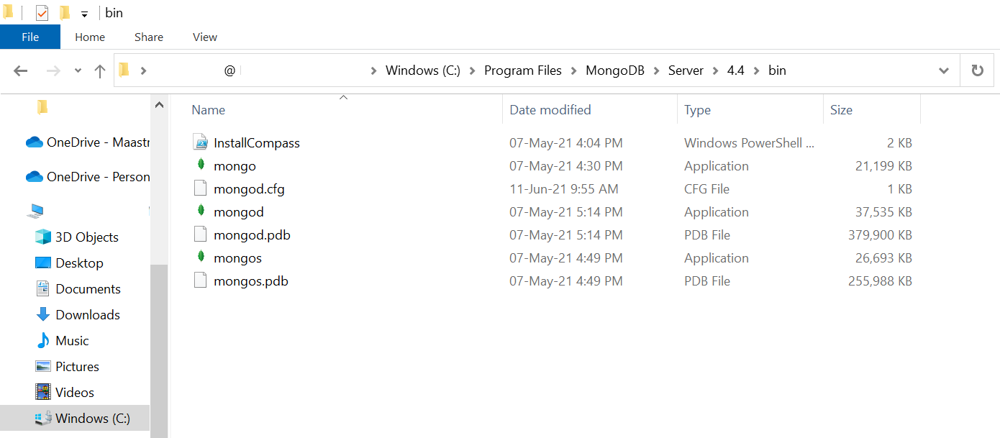
</div>


13. In the Windows search bar type `system environment variable`:

<div align="center">

</div>


14. Select `Edit the system environment variable`

15. Click `Environment Variables`:

<div align="center">

</div>


16. Double click on `path`:

<div align="center">

</div>


17. Now, you should see the following:

<div align="center">
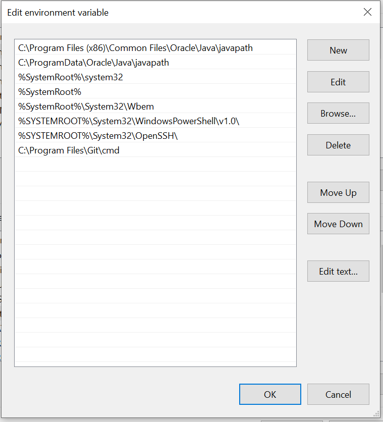
</div>


18. Go back to:

```bash
 C:\Program Files\MongoDB\Server\4.2\bin
 ```
19. Right-click on bin and copy the path:

<div align="center">
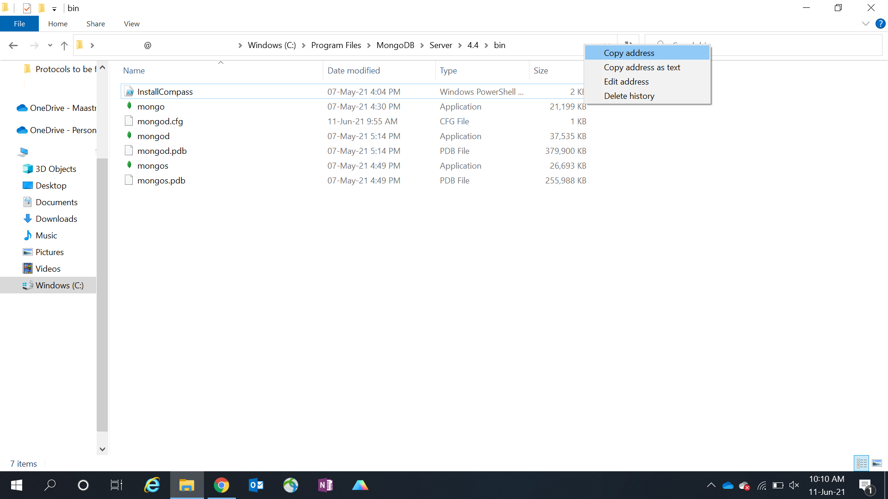
</div>


20. Now, within `environment variable`, click on `new` and paste the path:

<div align="center">
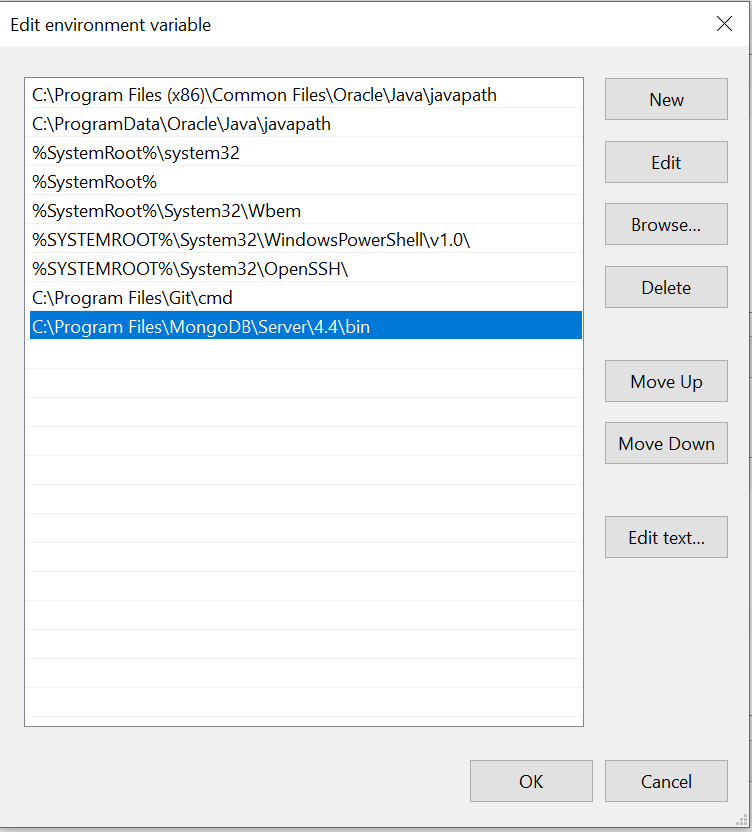
</div>


21. Click **OK**

22. Open the `Command Prompt` and type:

```bash
mongo --nodb
```

23. This is the result expected:

<div align="center">
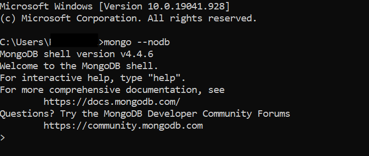
</div>


24. To exit, type:

```js
exit
```

25. To install MongoDB Compass, please navigate to this [page](https://www.mongodb.com/try/download/compass) and 
    download the .msi:

<div align="center">
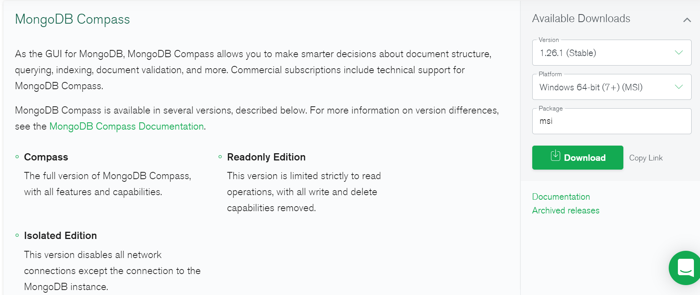
</div>