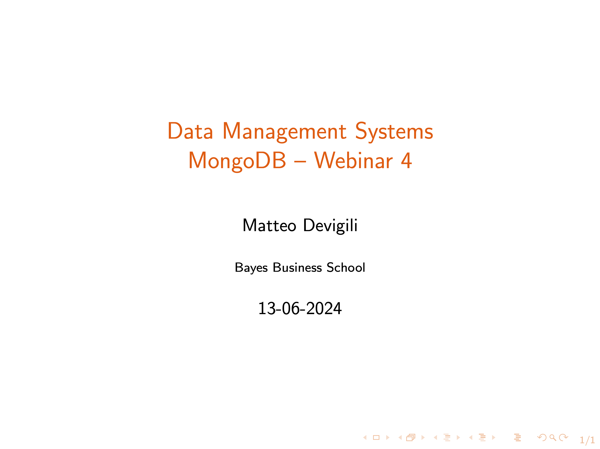

# Webinar 4 --- Structure

Webinar recording:

Here you can find the structure for the fourth webinar.

| **Week (date)** | **Agenda**                                           |
|-----------------|------------------------------------------------------|
| 4 (13-06)       | [AWS RDS](https://aws.amazon.com/rds/)               |
|                 | _Q&A_                                                |
|                 | Mongo Shell, Compass, Atlas                          |
|                 | Homework 4 solutions                                 |
|                 | [PyMongo](https://pymongo.readthedocs.io/en/stable/) |
|                 | - Basic Interaction                                  |
|                 | - Scraping & storing                                 |

Follow the [instructions](https://aws.amazon.com/getting-started/tutorials/create-connect-postgresql-db/) to 'create and connect to a PostgreSQL' database instance using
[Amazon Relational Database Service](https://aws.amazon.com/rds/).

**Please review the pre-recorded material before attending this webinar.**

## Material

Webinar materials:

* [whm_4.js](https://github.com/mattDevigili/dms-smm695/blob/master/week-4/webinar-4/whm_4.js): solutions for the [hw_4.md](https://mattdevigili.github.io/dms-smm695/week-4/hw_4.html);
* [wsc_4.ipynb](https://github.com/mattDevigili/dms-smm695/blob/master/week-4/webinar-4/wsc_4.ipynb): webinar 4 notebook.
