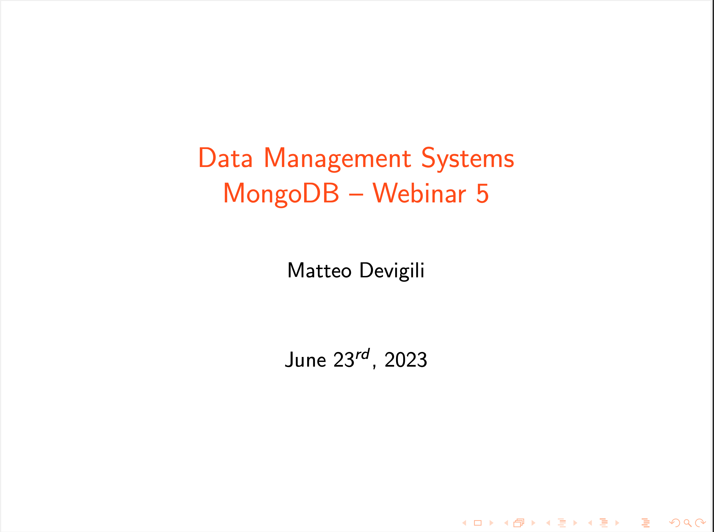

# Webinar 5 --- Structure

Webinar recording:

Here you can find the structure for the fifth webinar.

| **Week (date)** | **Agenda**                                           |
|-----------------|------------------------------------------------------|
| 5 (21-06)       | Homework 5 solutions                                 |
|                 | _Q&A_                                                |
|                 | [PyMongo](https://pymongo.readthedocs.io/en/stable/) |
|                 | - Design                                             |
|                 | - Loading                                            |
|                 | - Cleaning                                           |
|                 | [Pipeline Builder](https://docs.mongodb.com/compass/current/aggregation-pipeline-builder/)|
|                 | [Mongo Shell](https://docs.mongodb.com/manual/mongo/)|
|                 | - Cursor Methods                                     |
|                 | - Cursor-like stages                                 |
|                 | - Aggregation operators                              |
|                 | - Date functions                                     |
|                 | - $sample                                            |

## Material

Webinar materials:

* [whm_5.js](https://github.com/mattDevigili/dms-smm695/blob/master/week-5/webinar-5/whm_5.js): solutions for the [hw_5.md](https://mattdevigili.github.io/dms-smm695/week-5/hw_5.html);
* [wsc_5.ipynb](https://github.com/mattDevigili/dms-smm695/blob/master/week-5/webinar-5/wsc_5.ipynb): webinar 5 pymongo notebook;
* [wsc_5.js](https://github.com/mattDevigili/dms-smm695/blob/master/week-5/webinar-5/wsc_5.js): webinar 5 MQL script.
