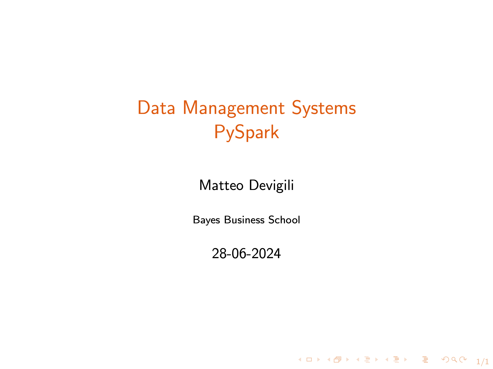

# Week 6 -- Intro to PySpark

Lecture recording:

In this video, you will (i) learn some basics of Spark functioning, (ii) have a
first introduction to the Spark Python API, and (iii) learn how to load data
from PostgreSQL and MongoDB.

This lecture focuses on the 6 topics:

| Week (dd-mm) | Topics                               | Min   |
| ------------ | ------------------------------------ | ----- |
| 6 (28-06)    | Introduction to PySpark              | 0:00  |
|              | PySpark Basics                       | 7:09  |
|              | PySpark and Pandas                   | 17:20 |
|              | PySpark and SQL                      | 25:35 |
|              | Connection to PostgreSQL and MongoDB | 30:35 |

To connect PostgreSQL & PySpark, you have to download `PostgreSQL JDBC Driver, 42.7.3` at this [link](https://jdbc.postgresql.org/download/).

Other material available:

* [sc_6.ipynb](https://github.com/mattDevigili/dms-smm695/blob/master/week-6/sc_6.ipynb): lecture notebook
* [webinar-6](https://mattdevigili.github.io/dms-smm695/week-6/webinar-6/): webinar 6 materials
