# Installing the Mongo Shell

Here you can find guidelines to set-up the Mongo Shell on your computer,
installing [MongoDB Community Edition](https://docs.mongodb.com/manual/administration/install-community/):

1. [MacOS](#macos), further guidance at [Mongo Docs](https://docs.mongodb.com/manual/tutorial/install-mongodb-on-os-x/)
1. [Windows](#windows), further guidance at [Mongo Docs](https://docs.mongodb.com/manual/tutorial/install-mongodb-on-windows/)

## MacOS

We will install MongoDB through Homebrew.

### Homebrew Install 

On MacOS, type the following on your terminal (skip step 1 if you have homebrew
installed):

1. Install [Homebrew](https://brew.sh):

```python
/bin/bash -c "$(curl -fsSL https://raw.githubusercontent.com/Homebrew/install/master/install.sh)"
```

2. Run:

```python
brew tap mongodb/brew
```

3. Now you can install the MongoDB Community Edition:

```python
brew install mongodb-community@4.2
```

### Run MongoDB

4. To run MongoDB as MacOS service, type on your terminal:

```python
brew services start mongodb-community@4.2
```

5. Then, you can start the mongo shell typing:

```python
mongo
```

6. To exit from the mongo shell, you can simply type:

```python
exit
```

7. To stop running MongoDB:

```python
brew services stop mongodb-community@4.2
```

## Windows

1. Visit the MongoDB Download center. Select Community Edition, Windows x64, and 
download the **MSI** file:
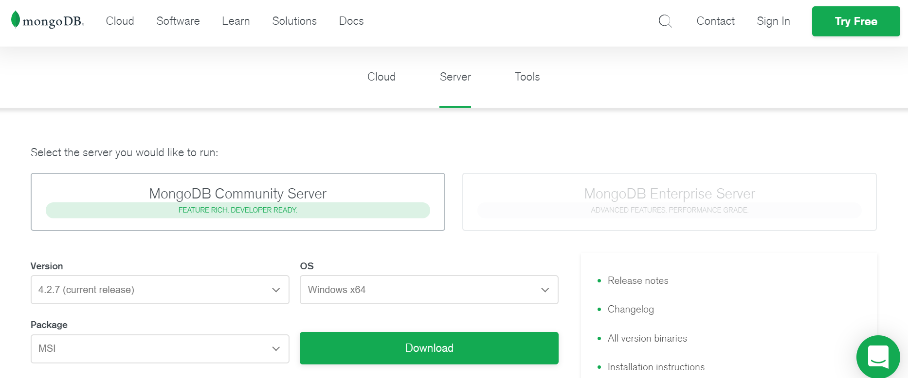

2. Once the download is completed, click on the downloaded file. The expected
   result is the following:
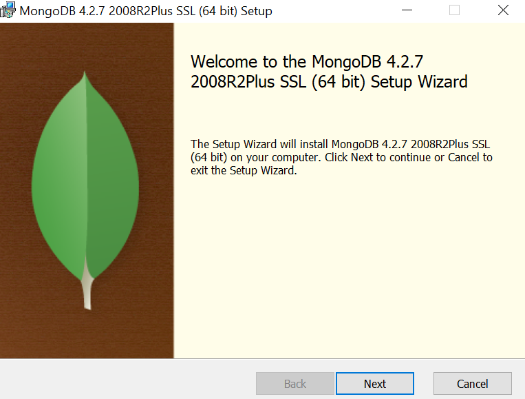

3. Click **Next**

4. Then, accept _'terms in the License Agreement'_:
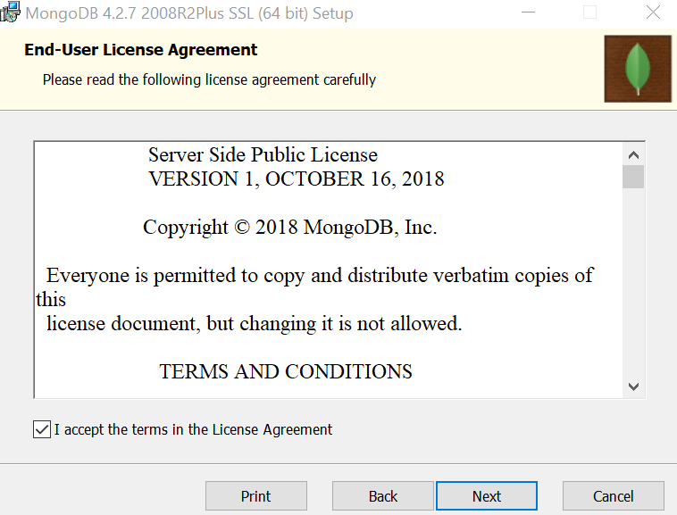

5. Choose the **complete** set-up type:
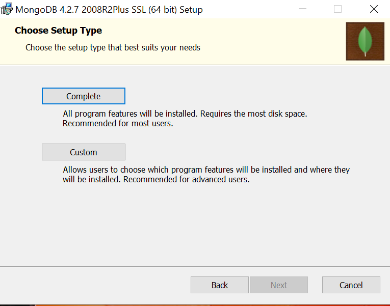

6. Leave **default** settings and click next:
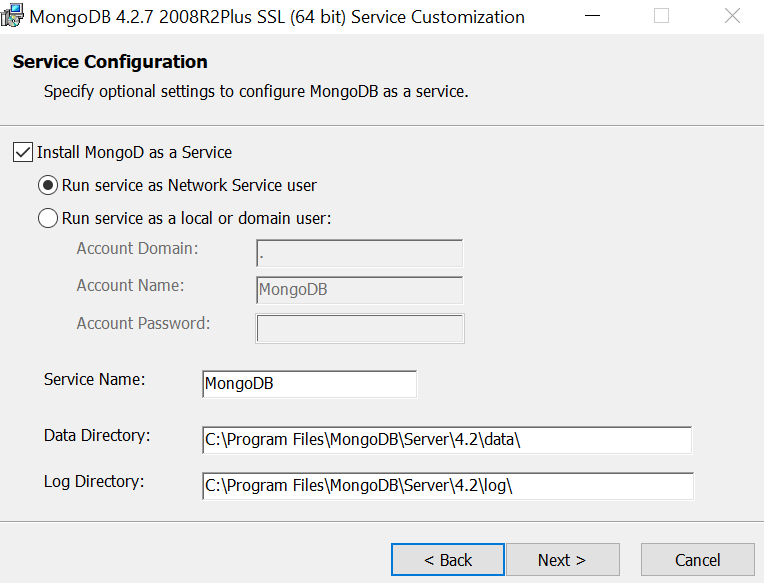

7. Do not install MongoDB Compass here. So, **uncheck** the box `Install MongoDB
   Compass`:
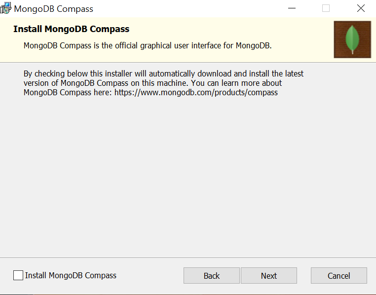

8. Click **Next**

9. Then, click **Install**

10. When the installation is completed, click **Finish**

11. Navigate to the following directory:
```python
 C:\Program Files\MongoDB\Server\4.2\bin
 ```

12. Check that everything is fine. The expected outcome should be:
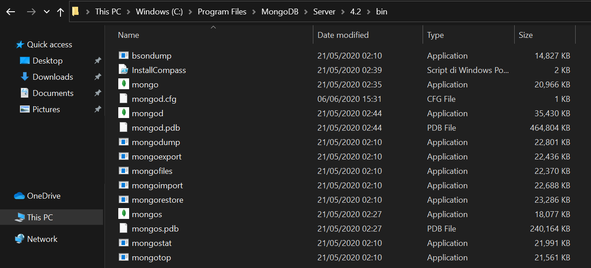

13. In the Windows search bar type `system environment variable`:


14. Select `Edit the system environment variable`

15. Click `Environment Variables`:
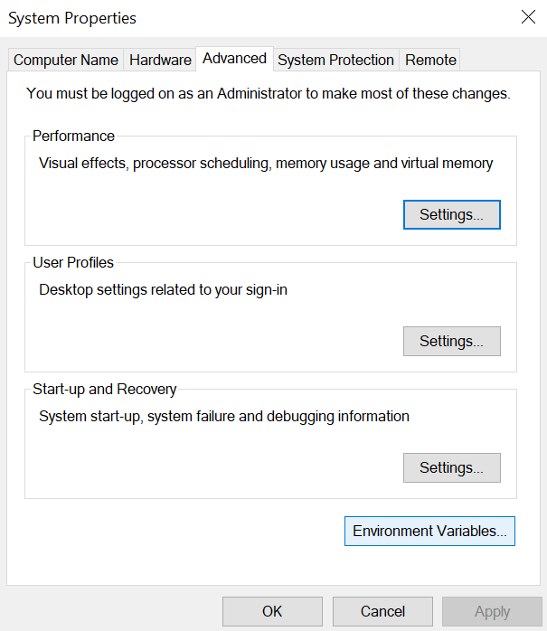

16. Double click on `path`:


17. Now, you should see the following:
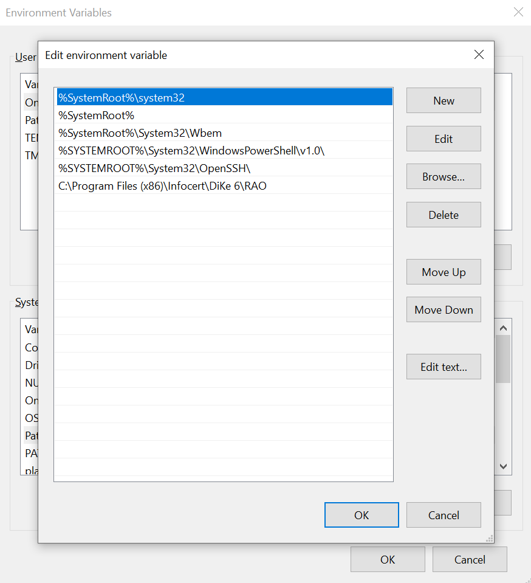

18. Go back to:
```python
 C:\Program Files\MongoDB\Server\4.2\bin
 ```
19. Right click on bin and copy the path:
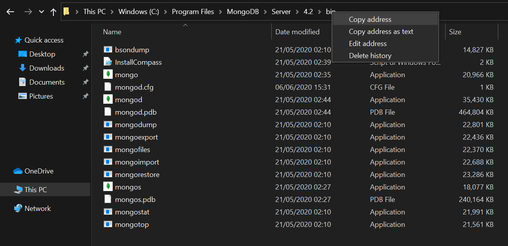


20. Now, within `environment variable` click on `new` and paste the path:
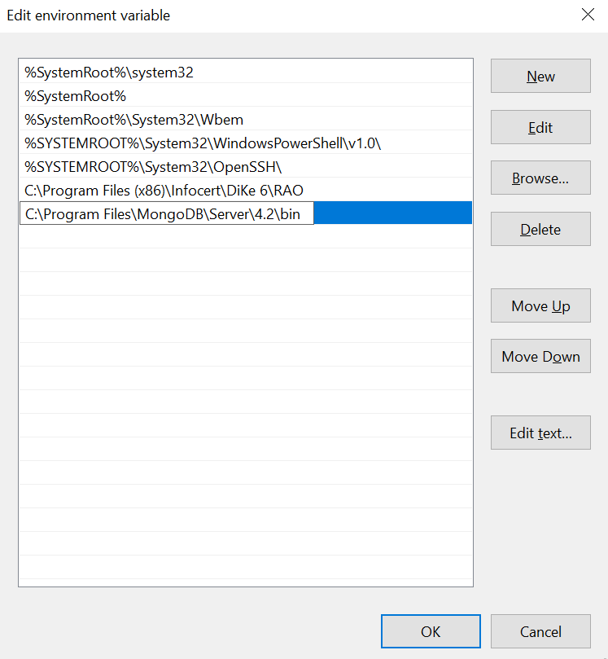


21. Click **OK**

22. Open the `Command Prompt` and type:
```python
mongo --nodb
```

23. This is the result expected:
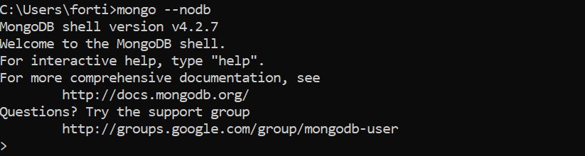

24. To exit, type:
```python
exit
```
